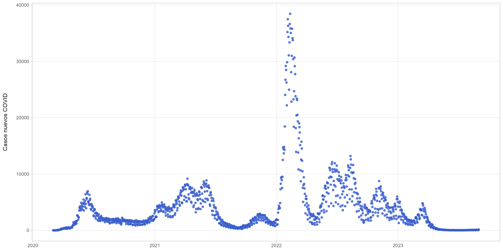

# covid

## Summary:

Análisis de la pandemia COVID en Chile utilizando datos del Ministerio de Salud procesados y disponibilizados por el Ministerio de Ciencia y Tecnología.

Datos hasta **31-08-2023**

## Repositorio de datos:

<https://observa.minciencia.gob.cl/datos-abiertos/datos-del-repositorio-covid-19>

 

## COVID stripes

Adaptación del famoso plot [Warming Stripes](https://en.wikipedia.org/wiki/Warming_stripes)

## Casos de covid positivos diarios

## Tendencia de casos de covid diarios

